# Full Derivation
We start with our basic equation definitions.
 * 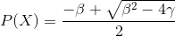
 * 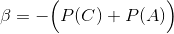
 * 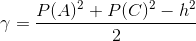

## Reformulate
First we want to reformulate in terms of our new  variable.
 * 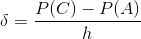

We can rewrite this so we have a new definition of 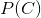
 * 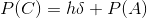

This allows us to derive new values for the other equations.
 * 
 * 
 * 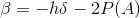
 * 
 * 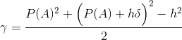
 * 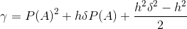
 * 
 * 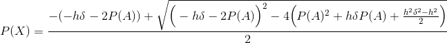
 * 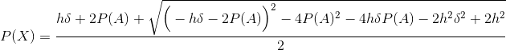
 * 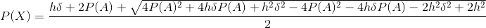
 * 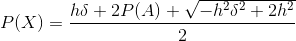
 * 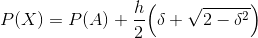

We're going to call this a new function 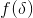, so now 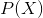 is in terms of 
 * 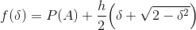

## Taylor Series Expansion
For computational efficiency, we are going to compute the Taylor series expansion. So first, we'll need the derivatives of .
 * 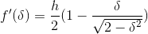
 * 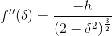

### 0th Order Taylor
 * 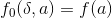
 * 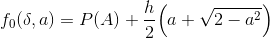

### 1st Order Taylor
 * 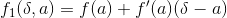
 * 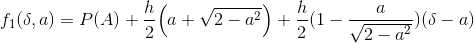
 * 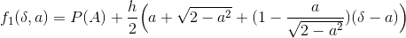
 * 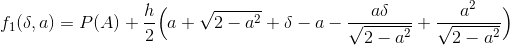
 * 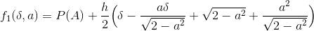
 * 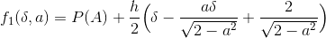

### 2nd Order Taylor
 * 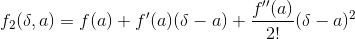
 * 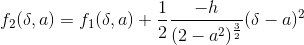
 * 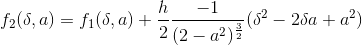
 * 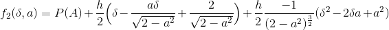
 * 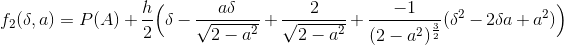
 * 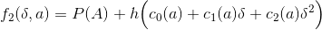
 * 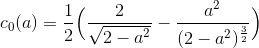
 * 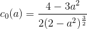

 * 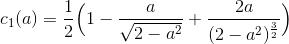
 * 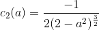

## Exact coefficients
Now that we have the general equations for the Taylor series, we can evaluate it at different values of a in the range `[0, 1]`.

|  | 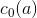 | 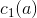 | 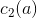 |
| ------ | ----------- | ----------- | ----------- |
|  0.0   |    0.7071   |    0.5000   |   -0.1768   |
|  0.5   |    0.7019   |    0.5270   |   -0.2160   |
|  1.0   |    0.5000   |    1.0000   |   -0.5000   |

Historically, the values used by [`navfn`](https://github.com/ros-planning/navigation/blob/1f335323a605b49b4108a845c55a7c1ba93a6f2e/navfn/src/navfn.cpp#L509) are

|  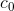   |     |     |
| ----------- | ----------- | ----------- |
|    0.7040   |   0.5307    |   -0.2301   |

You can see these values plotted [here](https://www.desmos.com/calculator/vbpkey1mt6).

The historical values are pretty close to the values for 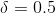, although the exact reason for the difference is unknown, but its close enough to not be overly concerning.
