# Full Derivation
We start with our basic equation definitions.
 * 
 * 
 * 

## Reformulate
First we want to reformulate in terms of our new  variable.
 * 

We can rewrite this so we have a new definition of 
 * 

This allows us to derive new values for the other equations.
 * 
 * 
 * 
 * 
 * 
 * 
 * 
 * 
 * 
 * 
 * 
 * 

We're going to call this a new function , so now  is in terms of 
 * 

## Taylor Series Expansion
For computational efficiency, we are going to compute the Taylor series expansion. So first, we'll need the derivatives of .
 * 
 * 

And then let's evaluate them at 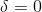. Here's the first derivative
 * 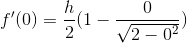
 * 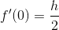

and the second
 * 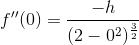
 * 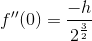

Now we can start to expand the Taylor series with .

### 0th Order Taylor
 * 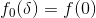
 * 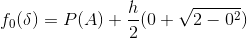
 * 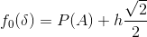

### 1st Order Taylor
 * 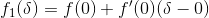
 * 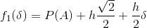
 * 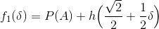

### 2nd Order Taylor
 * 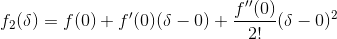
 * 
 * 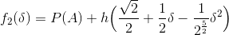

## Exact coefficients
More generally, we can say
 * 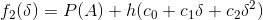

If we evaluate at  (as we did above), then we get
 * 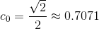
 * 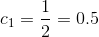
 * 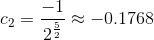

Historically, the values used by [`navfn`](https://github.com/ros-planning/navigation/blob/1f335323a605b49b4108a845c55a7c1ba93a6f2e/navfn/src/navfn.cpp#L509) are
 * 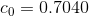
 * 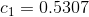
 * 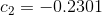

The exact reason for the difference in the values for  and `navfn` is unknown at this time, but the plots are close enough to each other that it is not overly concerning.
