# dlux_plugins

Be sure to start with the [documentation for `dlux_global_planner`](../dlux_global_planner/README.md).

## PotentialCalculators

The two key questions in calculating the potential are
 1. What order should we calculate the potential in?
 2. What value should we assign the the potential?

There are two potential calculators provided.
### Dijkstra
`dlux_plugins::Dijkstra` calculates the potential in full breadth first order, starting at the goal. The values that it
calculates are from the kernel function. Since the kernel function uses the minimum potential of two of the cell's four
neighbors, and breadth-first search guarantees the potential will not ever decrease, each potential is stable, i.e.
once a value is calculated, that value will not change, i.e. it will not get a new neighbor with a lower potential.

### AStar
`dlux_plugins::AStar` uses a heuristic to guide the order in which it calculates the potential. The heuristic can be
either the Manhattan distance or the Cartesian distance (depending on the `manhattan_heuristic` parameter; default is
false). You can also choose whether the calculated values use the kernel function, or are straightforward "one-neighbor"
potentials (using the `use_kernel` parameter, default is true).

If using the kernel function, however, the values can be unstable. Because the calculated potentials are not
non-decreasing (i.e. if it reaches a dead end, it will go back and compute lower potentials again), the algorithm will
sometimes need to decrease the value of previously calculated potential. As a result, the cell will be requeued, and
all cells that depended on the previous value will also need to be recalculated. Thus, `AStar` may end up expanding more
cells than `Dijkstra`! For an illustrated example of this, see
[this presentation](https://docs.google.com/presentation/d/1UCwH9RLuhKtlNKafDLN4vy4FBX4p5xueGU9UrOqoDG4/edit?usp=sharing)

One way to prevent this is to only change the potential if the value changes by a certain amount. This is implemented
with the `minimum_requeue_change` (default is 1.0) such that if the potential changes by less than that threshold, the
change in potential will be ignored, and the cell will not be requeued. While this results in slightly different
potentials being calculated, the time savings can justify "good enough" potentials.

## Traceback Algorithms
There are three traceback algorithms provided.
 * `dlux_plugins::VonNeumannPath` - Moves from cell to cell using only the cell's four neighbors.
 * `dlux_plugins::GridPath` - Moves from cell to cell using the cell's eight neighbors.
 * `dlux_plugins::GradientPath` - Uses the potential to calculate a gradient not constrained by the grid.

### GradientPath
At each cell it visits it calculates a two-dimensional gradient based on the potentials in the neighboring cells. It
then uses that gradient to calculate the next point on the path `step_size` away (default 0.5). The result is often
shorter, smoother paths. This was the default `navfn` behavior.

There are two additional parameters that step from the `navfn` roots of this code. First, `lethal_cost` (default=250.0)
is a constant used in calculating gradients near lethal obstacles. There is also `grid_step_near_high` (default false).
In the original `navfn` implementation, if the current cell in the traceback was adjacent to a uncalculated potential,
it would revert back to moving directly to one of the eight neighbors (a.k.a. a grid step). However, this is not
strictly necessary, and is turned off by default.

One final parameter is `iteration_factor` (default 4.0). As a safeguard against infinitely iterating through local
minima in the potentials, we limit the number of steps we take, relative to the size of the costmap. The maximum number
of iterations (and therefore steps in the path) is `width * height * iteration_factor`.

# Example Paths
Different combinations of plugins and parameters will result in different paths.
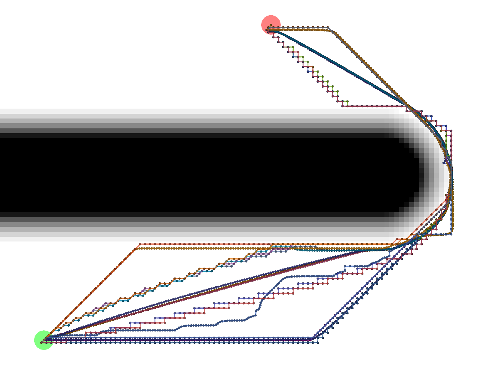
Start location in green, goal in red.

## Example Tracebacks
Let's start by looking at the different possible Tracebacks.
### VonNeumann
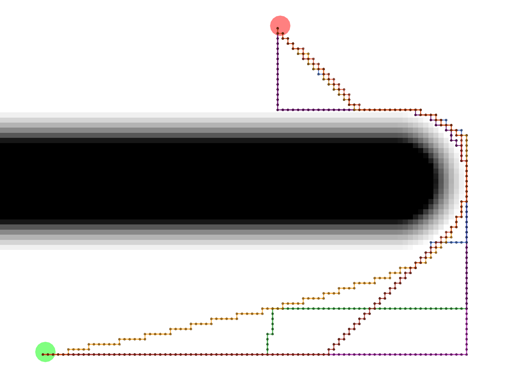
All of these paths actually have the same exact length.

### Grid
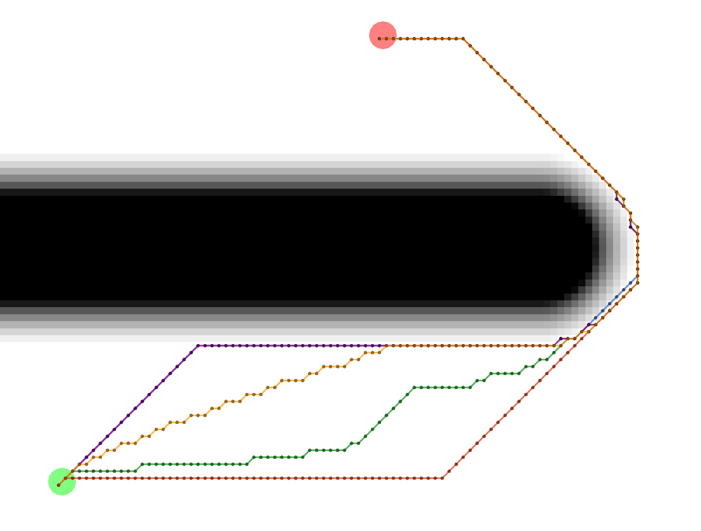
All of these Grid paths are a bit shorter than the VonNeumann paths, but since they are constrained to certain
diagonals, they are not optimally short.

### Gradient
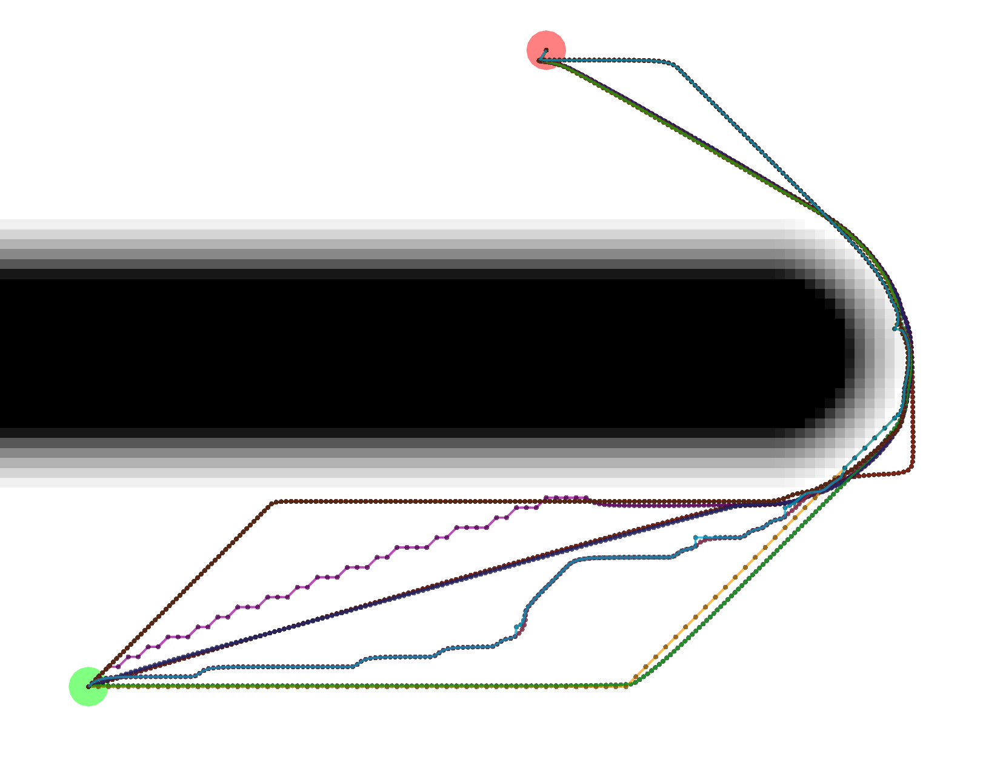
Gradient paths tend to be the shortest, but are a bit more complicated to compute. Some of them look like Grid paths
either because of the potentials that were calculated or because the Gradient path sometimes uses grid-constrained
steps as a backup.

## Example Potential Calculations
Each potential calculation is shown with the four tracebacks (there's two Gradient paths with different values of
`grid_step_near_high`)

### Dijkstra
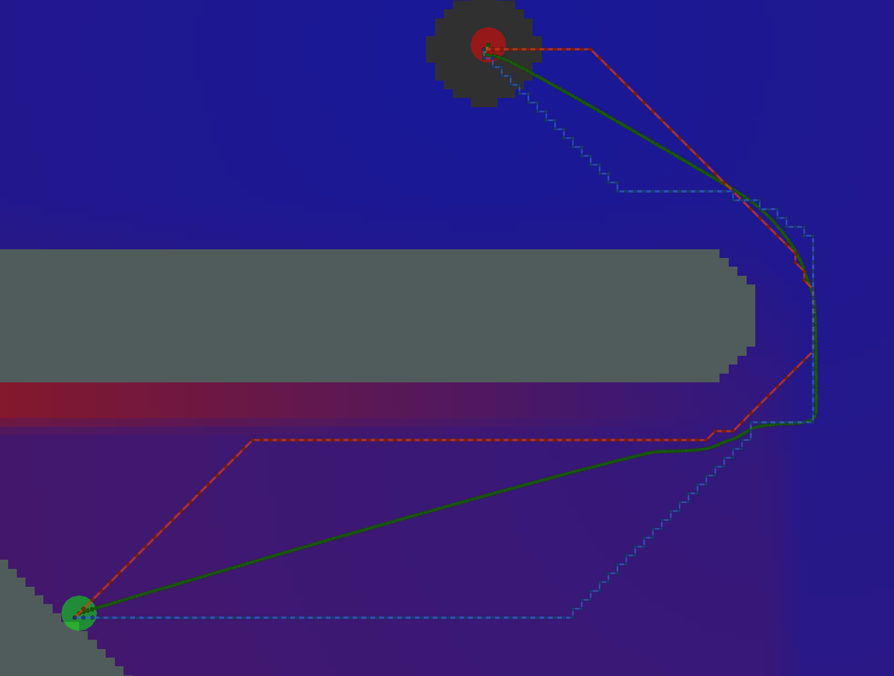
As expected, Dijkstra calculates the most potentials.

### AStar with Manhattan Heuristic
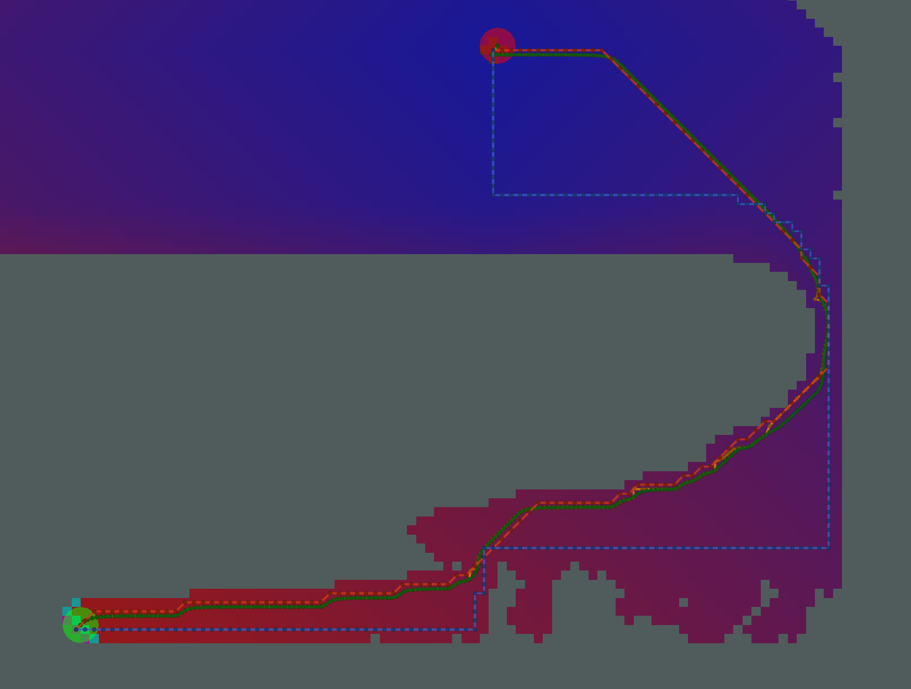
AStar calculates fewer potentials here. However, since there are many cells on the bottom of the image with the same
heuristic (i.e. same Manhattan distance to the start and same Manhattan distance to the goal), the resulting pattern of
calculated and uncalculated potentials looks random.

### AStar with Euclidean Heuristic
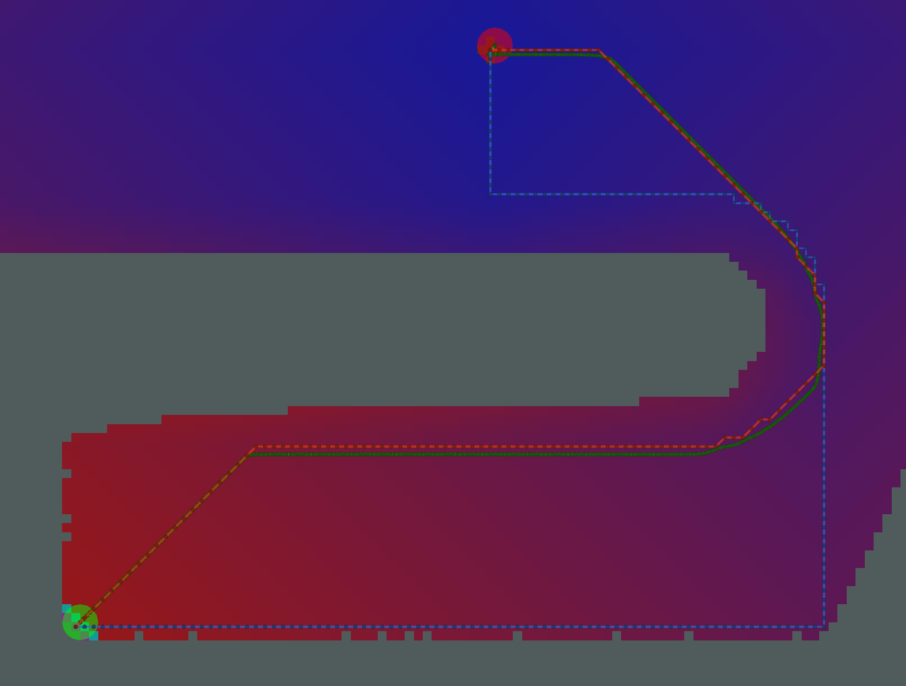
The pattern of calculated/uncalculated potentials here is less random. However, the Grid and Gradient paths are nearly
the same because the kernel function is not used.

### AStar with Kernel and Manhattan Heuristic
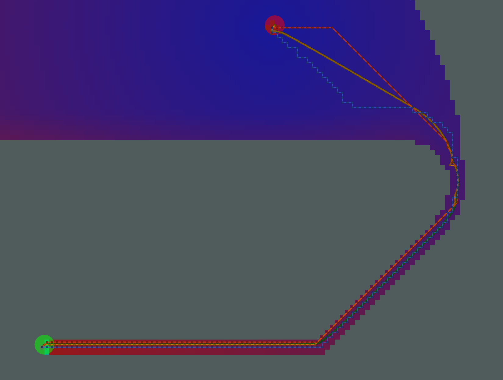
Many fewer potentials expanded here, but the path is not sufficiently short, due to the limited potentials to traceback
through.

### AStar with Kernel and Euclidean Heuristic
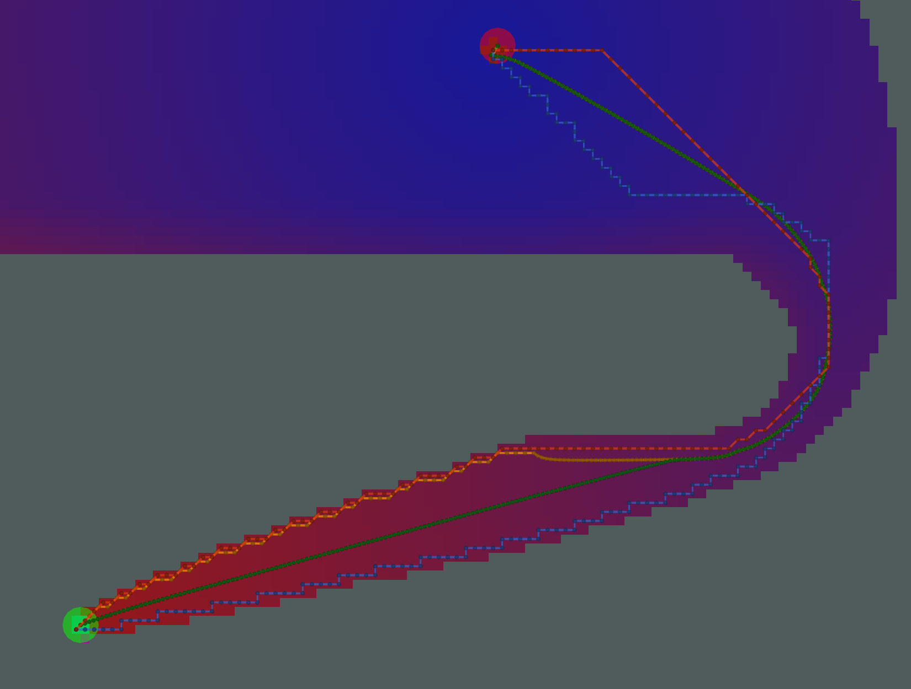
Here, we have an example where the two Gradient paths (orange and green) are noticeably different. The orange path has
`grid_step_near_high=true`, and gets "stuck" along the border of the potential. The green path has
`grid_step_near_high=false` and results in a much smoother path.

## Analysis
There is a tradeoff between number of cells expanded / potentials calcualted and the resulting length of the path.
Ideally, you would minimize each. For _the particular start/goal shown in the examples above_, we can plot the number
of cells and length of the path.
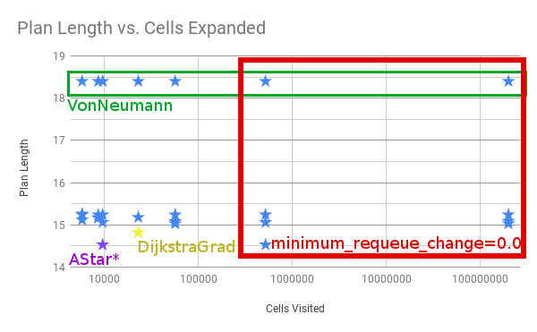

Four things to call out.
 * All of the examples in the red box with the most cells visited have `minimum_requeue_change=0.0`
 * All the longest paths in the green box use the `VonNeumann` traceback.
 * `NavFn` and `Dijkstra + GradientPath` result in the yellow star.
 * The absolute shortest path is marked in purple as `AStar*`, meaning AStar using the Kernel and Euclidean Heuristic.
  It's shorter than Dijkstra in this one particular example because the `DijkstraGrad` path takes one extra little
  loop, as shown below.

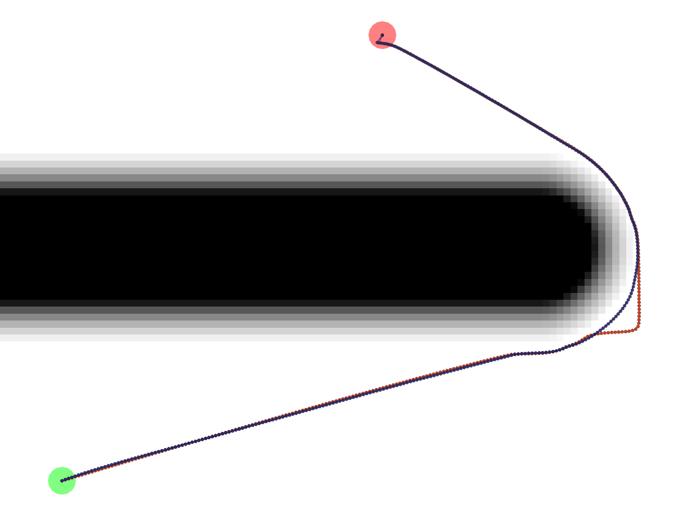

The exact reason for the difference in paths is unknown at this time.

## Tests
`test/planner_test.cpp` makes use of the `global_planner_tests` package to run a series of tests on some key
combinations of plugins and parameters. `test/full_planner_test.cpp` is not run by default and runs ALL combinations.

## Demo
You can also run `roslaunch dlux_plugins node_test.launch` to run multiple instances of the `planner_node.cpp` which
will show the variation between the different paths as shown above.
