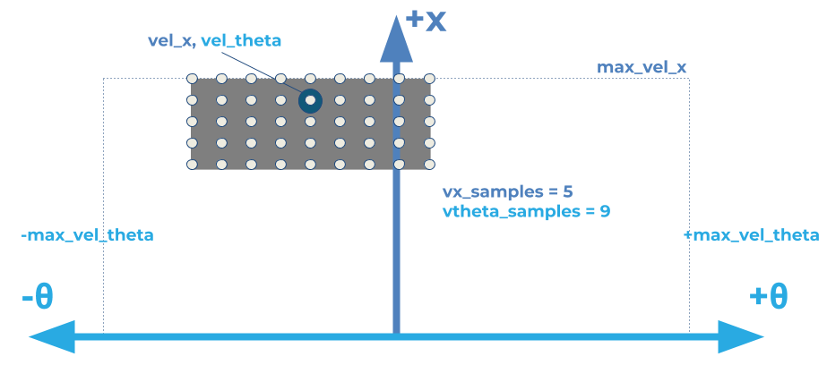
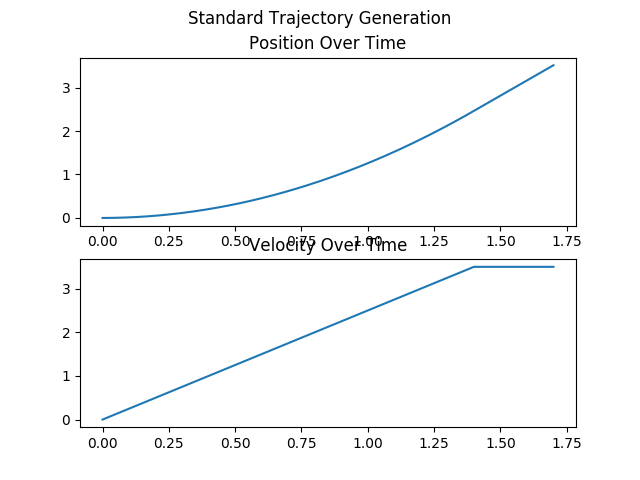
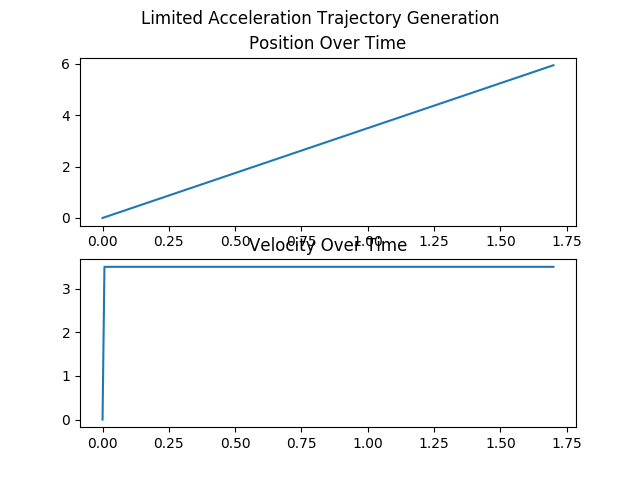

# dwb_plugins

This package contains the standard implementations of the GoalChecker and TrajectoryGenerators for `dwb_local_planner`. The TrajectoryCritic implementations are in `dwb_critics`.

## Goal Checkers
There are two goal checkers implemented.
### SimpleGoalChecker
SimpleGoalChecker will return true indicating a goal has been reached when the query pose is sufficiently close to the goal pose. It does this by comparing the cartesian difference against the `xy_goal_tolerance` and the shortest angular difference to the `yaw_goal_tolerance`. It does not check velocity.

If the `stateful` parameter is set to true (which it is by default), once the desired cartesian difference is obtained, it will not check the cartesian difference again (until reset) and only check the yaw tolerance. This handles cases where the robot may accidentally leave the desired `xy_goal_tolerance` while rotating to the desired yaw. If `stateful` is true, this won't force the robot to try to move closer to the goal again, and instead just rotate to the goal.

### StoppedGoalChecker
StoppedGoalChecker builds off of the above functionality, but also ensures that the robot's linear velocity is less than `trans_stopped_velocity` and the rotational velocity is less than `rot_stopped_velocity`.

## Trajectory Generation
Trajectory Generation covers two separate but related components.
 * First, it defines which command velocities are available, given the current velocity.
 * Second, given a velocity, it defines the trajectory the robot would take.

Generally, the available velocities are constrained by the robot's velocity and acceleration limits.

In the above diagram, the robot's current velocity is marked with a blue circle, and the grey rectangle marks the allowable velocities, limited by acceleration, and the robot's maximum x velocity. However, the exact size of the rectangle also depends on a time parameter, which we get into below.

When converting the velocities to trajectories, the robot's position is projected ahead in both time and space. This is dependent on a time parameter (called `sim_time`) for how far into the future to project the robot's position. For a simple example, assume we had a robot at `x=0` travelling at `xv=2.0`, and we want to calculate the trajectory for `xv=2.0`. It might result in the following poses if `sim_time=2.0`.
 * `t=0.0, x=0`
 * `t=1.0, x=2.0`
 * `t=2.0, x=4.0`

However, the trajectory is more open to interpretation when the speed is not constant.

### StandardTrajGenerator and LimitedAccelGenerator
To replicate the functionality of `dwa_local_planner`, this package implements two TrajectoryGenerators. StandardTrajGenerator is equivalent to using DWA with `use_dwa=false` and LimitedAccelGenerator is equivalent to DWA with `use_dwa=true` (which is the default). The key difference in these generators are how time and acceleration are handled.

As discussed above, `sim_time` is the parameter used for determining the time ellapsed in the trajectories (DWA's default was 1.7 seconds). In `StandardTrajGenerator` the available command velocities are limited by velocities reachable given the robot's acceleration in `sim_time`, i.e. the maximum available linear velocity is `vel_x + accel_x * sim_time`. In practice, given the relatively high value of `sim_time`, `StandardTrajGenerator` would allow for high accelerations almost instantaenously. For example, if initially motionless, with an accerlation of 1.0 m/s^2 and `sim_time=1.7`, the initial velocity could be 1.7 m/s.

In `LimitedAccelGenerator` the time used for calculating the accerlation portion is either the parameter `sim_period`, or the inverse of the `controller_frequency` (i.e. if `controller_frequency` is 20.0, `sim_period` is set to 0.05). Then the maximum linear velocity is calculated with `vel_x + accel_x * sim_period`. This results in MUCH lower velocities.

The other key difference between these two is how the acceleration is handled over time in the trajectory generation. In `StandardTrajGenerator` the velocity is allowed to change over the course of the trajectory based on the robot's acceleration, ramping up to the command velocity. In `LimitedAccelGenerator` the velocity is constant throughout the trajectory.

In the below example, the velocities are shown for an initial speed of 0.0 and commanded speed of 3.5 m/s.

