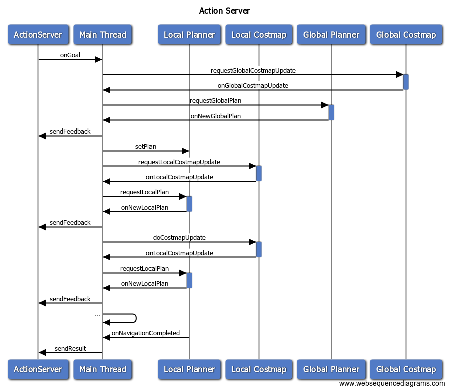

## Building on the Events
### Action Structure
Although Locomotor is a replacement for move_base, it does not use the same action definition. The existing `move_base_msgs/MoveBase.action` is wholly inadequate for almost anything useful.

```
# move_base_msgs/MoveBase.action
geometry_msgs/PoseStamped target_pose
---
---
geometry_msgs/PoseStamped base_position
```

You provide a goal pose, and the only feedback you get is the robot's current position. You do get a notification when the action is done, so that's nice.

[`locomotor_msgs`](../locomotor_msgs) provides a much richer action definition, although you can use your own action defintions in conjunction with Locomotor.


### Action Server
This package also provides the `LocomotorActionServer` class the enables `actionlib` to be integrated with the state machines. It generates the appropriate feedback and results, to be published when particular events are called.



The above diagram is the same as the single thread version but also shows interaction with the ActionServer in the leftmost column.

### ROS API vs C++ API
The core Locomotor code is strictly C++ based for maximum flexibility. Now there's a fundamental question here as to why we even expose a C++ API at all. Why not just have everything be action based? In this particular case, ROS's message system may not adequately cover the richness of the extensible classes that C++ provides.

In particular, one could not possibly define all the plausible error codes within a message/action definition. Such a list would not include specific errors that only occur in certain problem domains that other people's extensions of locomotor might require.

By implementing a custom state machine around Locomotor, one can define their own schema for error codes and the like, and publish feedback in a way compatible with the specific problem domain. That is why a specific action interface is not baked into the core `Locomotor` class, so that developers can define/choose their own action definition.
