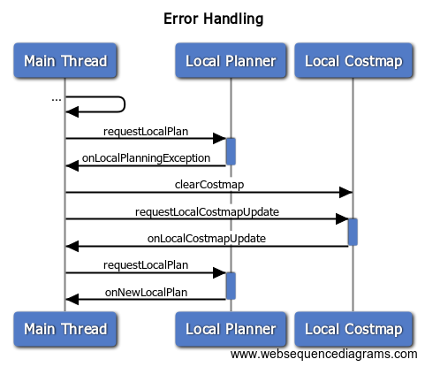

# Error Handling
Let's take a precise look at what the error handling functions look like.

```
using PlannerExceptionCallback = std::function<void (nav_core2::PlannerException, const ros::Duration&)>;
```

There are several standard extensions for the base `PlannerException` class in `nav_core2/exceptions.h` that will be passed as an exception pointer. When the function is called, you should be able to check the class of the exception against your known types and react accordingly. For instance,

```
void SomeStateMachine::onGlobalPlanningException(nav_core2::NavCore2ExceptionPtr e_ptr,
                                                 const ros::Duration& planning_time)
{
  try
  {
    std::rethrow_exception(e_ptr);
  }
  catch (nav_core2::OccupiedGoalException& e)
  {
    // modify the goal and try again
  }
  catch (nav_core2::PlannerTFException& e)
  {
    // wait 10 seconds, try again
  }
  catch (nav_core2::PlannerException& e)  // catch all
  {
    // trigger plan failure
  }
}
```

Importantly, the individual planners can implement their own extensions of `PlannerException` and have their version of `StateMachine` handle it however they like.

```
void LocomotorBrown::onGlobalPlanningException(nav_core2::NavCore2ExceptionPtr e_ptr,
                                               const ros::Duration& planning_time)
{
  try
  {
    std::rethrow_exception(e_ptr);
  }
  catch (LocomotorBrown::TimeTravelException& e)
  {
    // recalibrate flux capacitor
  }
  ...
}
```


## Recovery Behaviors
There are essentially two types of Recovery Behaviors.
 * Simple near-instantaneous actions, like clearing the costmap
 * Prolonged actions that attempt to clear things up (e.g. rotating in place for a bit)

The former can be handled in the error event handling. The latter could be represented as switching to a new planner for some set amount of navigation.



Alternatively, the `locomove_base` package is an implementation of Locomotor that uses the standard `nav_core::RecoveryBehavior` configurations that `move_base` uses for error handling.
