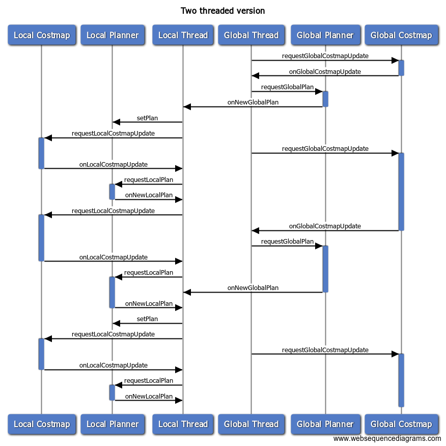

# Example State machines

# One Thread To Rule Them All
The simplest version of Locomotor is single threaded and works like this (assuming all goes to plan, pun intended).
 1. When a new goal is received, update the global costmap
 2. When that is completed, create a new global plan (`makePlan`)
 3. When that is completed, pass the global plan to the local planner (`setPlan`)
 4. Then update the local costmap.
 5. When that is completed, create a new local plan (`computeVelocityCommands`)
 6. Repeat steps 4 and 5 until the destination is reached

One main thread would handle all of events and request additional events.

In this super-simple version, we'll just handle errors very conservatively.
 * If the global costmap fails to update, or the global planning fails, we fail the whole navigation
 * If the local costmap fails to update, then we send a zero command velocity and try again
 * If the local planning fails, we send a zero command velocity AND trigger another global planning

This example is implemented in SingleThreadLocomotor using a timer to repeatedly do steps 4 and 5.

# It Takes Two (Threads)
The simple version would be unable to continuously create global plans without blocking the local planner. So you could also make a two `Executor` version that had similar logic.

The main difference is that there are two callback queues, one for the local costmap and planner and one for the global costmap and planner. The main point of crossover is that `onNewGlobalPlan` is put onto the local callback queue so that it can inform the local planner of the new plan.

This example is implemented in DoubleThreadLocomotor with two timers: one for triggering global costmap updates, and one that triggers local costmap updates.

# Other Configurations
You could also set up a four `Executor` version that triggers costmap updates and planning on fixed time cycles. However, that is not shown.
