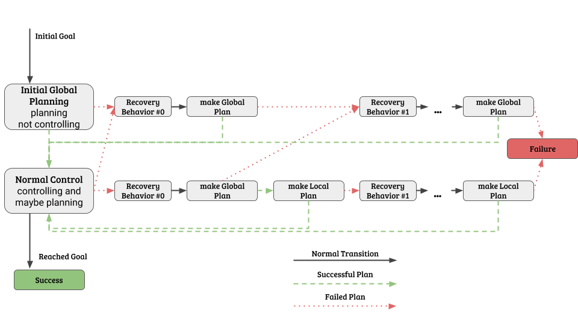

# locomove_base
## locomotor + move_base

`locomove_base` combines the engine that runs `locomotor` with the state machine that controls `move_base`.

## Planners
### Global Planners
Because they are interoperable, any global planner (be it `nav_core` or `nav_core2`) can be used. If `move_base` used a `nav_core` planner (which is standard), it will be loaded into `locomove_base` using the `nav_core_adapter::GlobalPlannerAdapter2`. If the `move_base` configuration used a `nav_core2` global planner using `nav_core_adapter::GlobalPlannerAdapter`, `locomove_base` will just use the `nav_core2` global planner without the adapter.

### Local Planners
Similarly, if the `move_base` configuration was using a `nav_core2` local planner with the `nav_core_adapter::LocalPlannerAdapter`, `locomove_base` can use that without the adapter.

However, because `nav_core` local planners are not forward compatibile, arbitrary `nav_core` local planners cannot be used in `locomove_base`. However, if the local planner was `DWALocalPlanner`, `locomove_base` will just use `DWBLocalPlanner` since its parameters are backwards compatible.

## Recovery Behaviors
Recovery behaviors come from `nav_core` and have the following interface:
```
class RecoveryBehavior
{
public:
  virtual void initialize(std::string name, tf::TransformListener* tf, costmap_2d::Costmap2DROS* global_costmap, costmap_2d::Costmap2DROS* local_costmap) = 0;
  virtual void runBehavior() = 0;
}
```
In order to be able to use RecoveryBehaviors, we must be able to get a raw pointer to the `Costmap2DROS` objects. Thus, the only type of `nav_core2::Costmap` we allow is `nav_core_adapter::CostmapAdapter` which will provide the pointer.

As in `move_base` the recovery behaviors are specified here as an ordered list on the parameter server (or uses a default set if no list provided). Each is initialized with the pointers shown above and stored.

When an error occurs, the recovery behaviors will be run using the `runBehavior` method in order, with the logic shown below.


## Move Base State Machine


### Standard Operation
If all the planning is successful, the state machine will travel along the left side of the diagram, i.e.
   * When it gets its initial goal, it will perform global planning.
   * When that succeeds, it will proceed onto local planning (i.e. controlling) and possibly making more global plans.
   * When it reaches the goal, the navigation was successful.

### Recovering from Failures
If either global or local planning fails, move_base will begin to execute the recovery behaviors in order. After each recovery behavior, it will attempt planning again. If that planning is also unsuccessful, it will proceed onto the next recovery behavior, and so on until the last recovery behavior leads to failed planning, at which point the navigation will fail.

`move_base` will reset back to standard operation if there is a successful plan made with the planner that originally failed.
 * If global planning fails, `move_base` will return to normal operation after a global plan is successfully made.
 * If local planning fails, `move_base` will try to make a new global plan after each recovery behavior, and then will only return to normal operation after local planning also succeeds.
