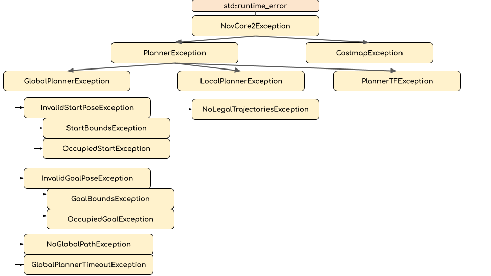

# nav_core2
A replacement interface for [nav_core](https://github.com/ros-planning/navigation/tree/a2837b5a9dc6dd4b4da176fca7d899d6a3722bf8/nav_core/include/nav_core) that defines basic two dimensional planner interfaces.

There were a few key reasons for creating new interfaces rather than extending the old ones.
 * Use `nav_2d_msgs` to eliminate unused data fields
 * Use a new `Costmap` interface as a plugin rather that forcing all implementations of the interfaces to use `costmap_2d::Costmap2DROS`.
 * Provide more data in the interfaces for easier testing.
 * Use Exceptions rather than booleans to provide more information about the types of errors encountered.

## `Costmap`
`costmap_2d::Costmap2DROS` has been a vital part of the navigation stack for years, but it was not without its flaws.
 * Initialization required a transform be available from the global frame to the base frame, which was later used to move rolling costmaps around (and a few other things). This made doing simple testing of any planner or other `Costmap2DROS`-based behavior annoying, because transforms had to be set up, often outside of the immediate code that was being tested.
 * Initialization also started an update thread, which is also not always needed in testing.
 * Using `Costmap2DROS` locked users into a layered costmap based approach, which made some tasks much easier, but didn't give users the freedom to change the implementation.

The [`nav_core2::Costmap`](include/nav_core2/costmap.h) interface extends the `nav_grid::NavGrid<unsigned char>` for abstracting away the data storage and coordinate manipulation, and provides a few other key methods for costmap functioning such as
 * a mutex
 * a way to potentially track changes to the costmap
 * a public `update` method that can be called in whatever thread you please

The `Costmap` can be loaded using `pluginlib`, allowing for arbitrary implementations of underlying update algorithms, include the layered costmap approach.

One basic implementation is provided in [`BasicCostmap`](include/nav_core2/basic_costmap.h). You can also use the `nav_core_adapter::CostmapAdapter` class which implements the `Costmap` interface while allowing you to still use `Costmap2DROS`.

Note: One could also imagine the `Costmap` interface being templatized itself like `NavGrid` instead of forcing use of `unsigned char`. While this may be possible, it was decided that it was a bit ambitious and the use of templates would force all of the implementation into headers, and would ultimately obfuscate the operation of algorithms.

## Global Planner
Let us compare the old [nav_core::BaseGlobalPlanner](https://github.com/ros-planning/navigation/blob/a2837b5a9dc6dd4b4da176fca7d899d6a3722bf8/nav_core/include/nav_core/base_global_planner.h) to the new [nav_core2/GlobalPlanner](include/nav_core2/global_planner.h).

| `nav_core` | `nav_core2` | comments |
|---|--|---|
|`void initialize(std::string, costmap_2d::Costmap2DROS*)`|`void initialize(const ros::NodeHandle& parent, const std::string&, TFListenerPtr, Costmap::Ptr)`|Uses modern pointers instead of raw pointers, and provides a TFListener|
|`bool makePlan(const geometry_msgs::PoseStamped&, const geometry_msgs::PoseStamped&, std::vector<geometry_msgs::PoseStamped>&)`|`nav_2d_msgs::Path2D makePlan(const nav_2d_msgs::Pose2DStamped&, const nav_2d_msgs::Pose2DStamped&)`|Uses exceptions for errors instead of returning a bool, which frees up the return for the actual path.|

## Local Planner
Now let's compare the old [nav_core::BaseLocalPlanner](https://github.com/ros-planning/navigation/blob/a2837b5a9dc6dd4b4da176fca7d899d6a3722bf8/nav_core/include/nav_core/base_local_planner.h) to the new [nav_core2/LocalPlanner](include/nav_core2/local_planner.h).

| `nav_core` | `nav_core2` | comments |
|---|--|---|
|`void initialize(std::string, tf::TransformListener*, costmap_2d::Costmap2DROS*)`|`void initialize(const ros::NodeHandle& parent, const std::string&, TFListenerPtr, Costmap::Ptr)`|Uses modern pointers instead of raw pointers|
|(no equivalent)|`void setGoalPose(const nav_2d_msgs::Pose2DStamped&)`|Explicitly set the new goal location, rather than using the last pose of the global plan`
|`bool setPlan(const std::vector<geometry_msgs::PoseStamped>&)`|`setPlan(const nav_2d_msgs::Path2D&)`||
|`bool computeVelocityCommands(geometry_msgs::Twist&)`|`nav_2d_msgs::Twist2DStamped computeVelocityCommands(const nav_2d_msgs::Pose2DStamped&, const nav_2d_msgs::Twist2D&)`|Explicitly provides the current pose and velocity for more explicit data control and easier testing. Uses exceptions for errors instead of returning a bool, which frees up the return for the actual command.|
|`bool isGoalReached()` | `bool isGoalReached(const nav_2d_msgs::Pose2DStamped&, const nav_2d_msgs::Twist2D&)` | Explicitly provide the current pose and velocity for more explicit data control and easier testing. |

## Exceptions
A hierarchical collection of [exceptions](include/nav_core2/exceptions.h) is provided to allow for reacting to navigation failures in a more robust and contextual way.

Each exception has a corresponding integer "result code" that can be used in ROS interfaces where passing the C++ object is infeasible. Note that due to the hierarchy, the result_code will be for the child-most exception. For example, if you throw a `StartBoundsException` which has a corresponding result code of `6`, it could also be seen as a `InvalidStartPoseException`, `GlobalPlannerException`, `PlannerException` or `NavCore2Exception`, all of which would also have the result code of `6`.

## Bounds
For use in tracking `Costmap` changes and more, this package also provides an implementation of [bounding boxes](include/nav_core2/bounds.h). These are represented with the ranges `[min_x, max_x]` and `[min_y, max_y]` (inclusive).
