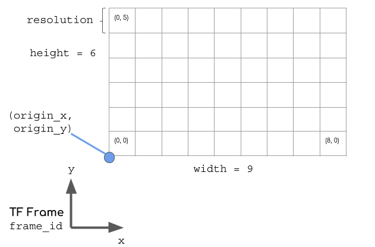
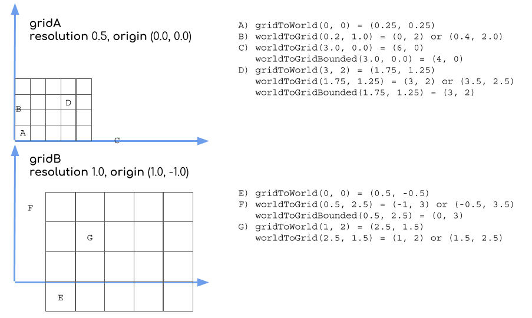
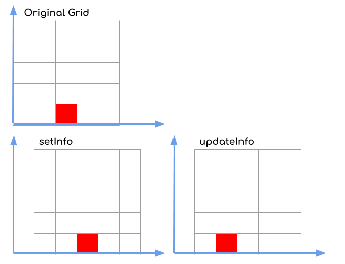

# nav_grid

Many navigation algorithms rely on the concept of a two dimensional grid being overlaid on the world, with a value being assigned to each grid cell. In the original navigation stack, `Costmap2DROS` associated an `unsigned char` with grid cells, global planners cache distance to the goal as `float`s and local planners would cache various metrics in a grid to quickly calculate the strength of different trajectories.

## `NavGridInfo`

Where the grid exists in the world is defined by six parameters.
 * `width` and `height` (which together define the number of cells in the grid)
 * `resolution` which is the dimension of each cell in meters (square cells only)
 * `frame_id` which is the TF frame the grid is defined relative to.
 * `origin_x` and `origin_y` which define the offset in meters from the root of the TF frame to the minimum corner of the (0, 0) cell.

Together, these components make a [`nav_grid::NavGridInfo`](include/nav_grid/nav_grid_info.h) struct. It evolved from the [`nav_msgs::MapMetaData` message](http://docs.ros.org/melodic/api/nav_msgs/html/msg/MapMetaData.html) but without `map_load_time`, simplified origin geometry and the `frame_id` added. Note: for general efficiency of computation (particularly moving the grid while retaining some of the values) there is no rotation component to the origin. Each grid is locked to the orientation of its TF frame.

The default values are `width=0, height=0, resolution=1.0, frame_id="map", origin_x=0.0, origin_y=0.0`.

## Coordinate Conversion
One of the most common operations is to want to convert between the real world coordinates and the grid coordinates. These operations can be done with a `NavGridInfo` object and the methods in [`coordinate_conversion.h`](include/nav_grid/coordinate_conversion.h). They are derived from methods in [`costmap_2d.h`](https://github.com/ros-planning/navigation/blob/a2837b5a9dc6dd4b4da176fca7d899d6a3722bf8/costmap_2d/include/costmap_2d/costmap_2d.h#L126), but with some key differences (beyond replacing `map` with `grid`).
 * `gridToWorld` is the same as `mapToWorld`, as both return the world coordinates of the center of the specified cell.
 * `worldToGrid` works like `worldToMapNoBounds`, but it results in either `int` or `double` coordinates depending on the output parameter types. As the result are not bounded by the grid, the results are signed.
 * `worldToGridBounded` is a combination of `worldToMap` and `worldToMapEnforceBounds`. It returns a bool for whether the input coordinates are within the grid AND the output coordinates are forced to be within the grid. The output coordinates are therefore `unsigned int`.
 * There's also `isWithinGrid` that returns whether a given point is within the grid (i.e. will match the return value of `worldToGridBounded` but saves some of the computation associated with calculating the actual values of the coordinates.

## `NavGrid<T>`
Of course, we also want to associate a value with each cell in the grid. For that, we define the templatized [`nav_grid::NavGrid<T>`](include/nav_grid/nav_grid.h) abstract class. The template allows for storing arbitrary data types associated with each grid cell. The actual storage mechanism for the data is not part of the base class to allow for possibly more efficient methods. A default implementation where the data is simply stored in row-major order in a one-dimensional vector is provided in [`nav_grid::VectorNavGrid<T>`](include/nav_grid/vector_nav_grid.h>)

The constructor for `NavGrid` takes a default value for each cell which is 0 by default. The grid's initial info matches the default info above, so the grid is initially `0x0`.

The `NavGrid` class provides handy methods for accessing values via their grid indexes. You can use `grid(x, y)` or `grid.getValue(x, y)` to access each value, and use `grid.setValue(x, y, value)` to write each value. There is also the helper class [`nav_grid::Index`](include/nav_grid/index.h) that can be used to store the two coordinates and used in accessing the data as well a la `grid(index)` and `grid.setValue(index, value)`.

There are two methods for changing the `info` associated with the grid: `setInfo` and `updateInfo`. `setInfo` changes the `info` while maintaining the data associated with each grid coordinate. `updateInfo` will change the info but instead maintain the data associated with the world coordinates.

For instance, imagine a 5x5 grid with 0.5 meter resolution with the cell (2, 0) set to red which represents a cell at (1.25, 0.25) in the world. If we change the origin to be 0.5 meters to the right, the grids will have different values according to the method we use. With `setInfo`, cell (2, 0) is still red, but it is associated with a cell at (1.75, 0.25) in the world. With `updateInfo`, the cell at (1.25, 0.25) is still red, but it is now associated with cell (1, 0). The exact mechanism for how this data is preserved is left to the implementing class.

