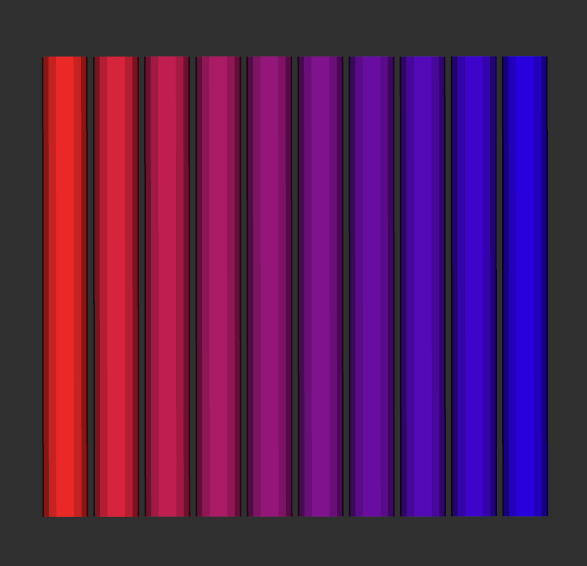

# color_util
An almost dependency-less library for converting between color spaces

## Datatypes
This package contains representations for two different color spaces with two different datatypes in [include/color_util/types.h](include/color_util/types.h):
 * Red-Green-Blue-Alpha (`RGBA`)
 * Hue-Saturation-Value-Alpha (`HSVA`).

Each of these are represented with two datatypes.
 * Four `double`s with values ranging `[0.0, 1.0]`
 * Four `unsigned char`s with values ranging `[0, 255]`.

Note that with `unsigned char`, the color is represented by a total of 24 bits, which we use for notation. The four resulting types are
 * `ColorRGBA` - `RGBA/double`
 * `ColorRGBA24` - `RGBA/unsigned char`
 * `ColorHSVA` - `HSVA/double`
 * `ColorHSVA24` - `HSVA/unsigned char`

## Conversions
With [include/color_util/convert.h](include/color_util/convert.h), you can convert between the above types and to `std_msgs::ColorRGBA` (which has floating point as its datatype).

## Blending
With [include/color_util/blend.h](include/color_util/blend.h), you can create mixtures of two different colors. There are three options.

| Blend Method   | Image | Note |
| ------------   | ----- | ---- |
| `rgbaBlend`    |  | Linear interpolation of the `RGBA` values. Note that the bars in the middle are less saturated than the edges. |
| `hueBlend`     |  | Linear interpolation of the `HSVA` values. In this example, it goes from red (hue=0.0) to blue (hue=0.6) through green (hue=0.3) |
| `hueBlendPlus` |  | Respects the circular nature of the hue representation and uses the shortest linear interpolation of the `HSVA` values. In this example, it goes from red (hue=0.0) to blue (hue=0.6) through magenta (hue=0.8) |

You can experiment with the blending methods by running `roslaunch robot_nav_viz_demos spectrum_demo.launch`.

## Named Colors
For certain applications, there is a need for accessing specific colors, and it can be annoying to have to specify hex values for each individual color. Other times, you may want to access a list of some number of unique colors. For this, this package provides the [`named_colors` header](include/color_util/named_colors.h) which allows you to access an array of 55 named colors either through a vector or an enum. The colors are made up of 18 colors, each with a standard, light and dark variant, plus transparent.

The list can be accessed with `color_util::getNamedColors()` and individual colors can be grabbed with `color_util::get(NamedColor::RED)`
