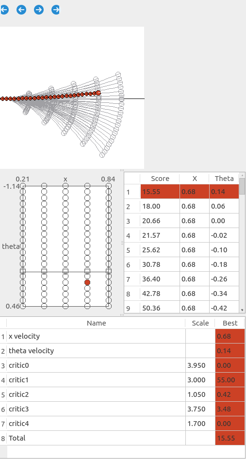
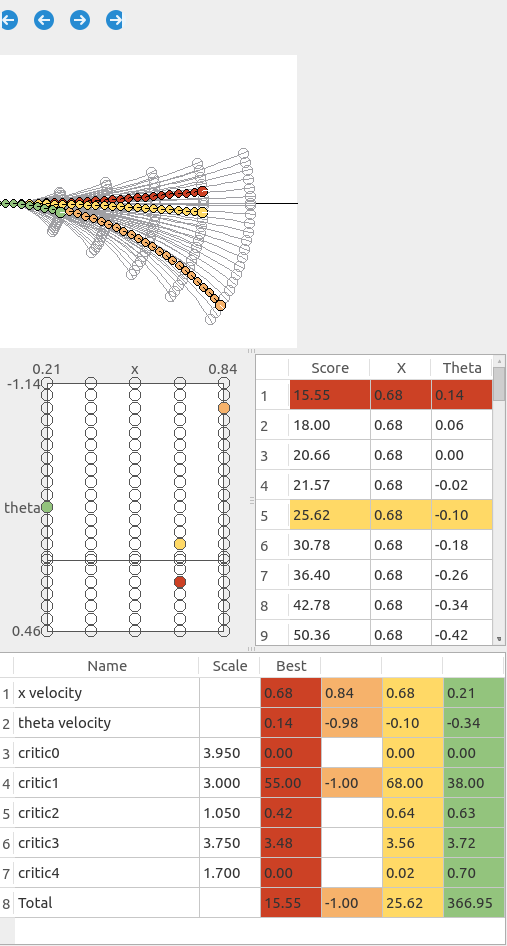
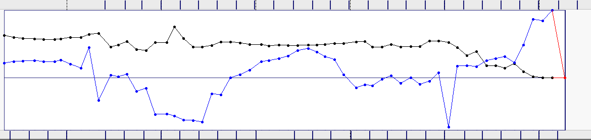

# rqt_dwb_plugin

This package allows you to view `dwb_msgs/LocalPlanEvaluation` information visually using `rqt`. Currently only `x/theta` velocities are supported. The information can be viewed inside of `rqt_bag` or as an independent application. For a high level view of how `rqt_bag` plugins work,
check out [this tutorial](http://wiki.ros.org/rqt_bag/Tutorials/Create%20an%20rqt_bag%20plugin).

## Eval View
You can show detailed information about a single `LocalPlanEvaluation` in one of two ways:
 * Within `rqt_bag` you can right click the `LocalPlanEvaluation` data much the same way you
     would view the raw values of the message.
 * You can also view live data with an independent application by running
   `rosrun rqt_dwb_plugin live_panel _ns:=/move_base/DWBLocalPlanner`

This view has four different components.

 * **Trajectory Cloud** -
The top panel shows the Trajectory "Cloud", with each of the poses for each of the trajectories drawn relative to the robot's starting coordinates.

 * **Velocity Space** -
The left panel shows each of the individual trajectories being evaluated in velocity space. The x axis represents the x component and the y axis represents the theta component. The highest and lowest values are displayed in the axis labels.

 * **Sorted Scores** -
The right panel shows a table of the total score for each trajectory, as well as the x/theta velocity for that trajectory. They are sorted with increasing scores, thus the best option will always be first.

 * **Detailed Scores** -
The bottom panel shows the detailed critic scores for the selected trajectories.

### Selecting Additional Trajectories
The left and right panels give you the ability to select additional trajectories to be highlighted. Clicking in either the velocity space or sorted scores will add a trajectory from each panel in a new color. You can click again to remove it.

### Additional Topics
Note that if `/transformed_global_plan` and `/velocity` also exist in the bag file with the same namespace, the plan will be drawn into the trajectory cloud, and the current velocity will be drawn into the velocity space.

## Timeline Plot
This feature only works within `rqt_bag`. If you turn on "Thumbnails"  for `LocalPlanEvaluation` data, it will show a plot of the best velocity values.

* The black line is the x component and blue is the theta component.
* If local planning failed, the values will be 0 and displayed in red, as seen at the end of the above bag.
